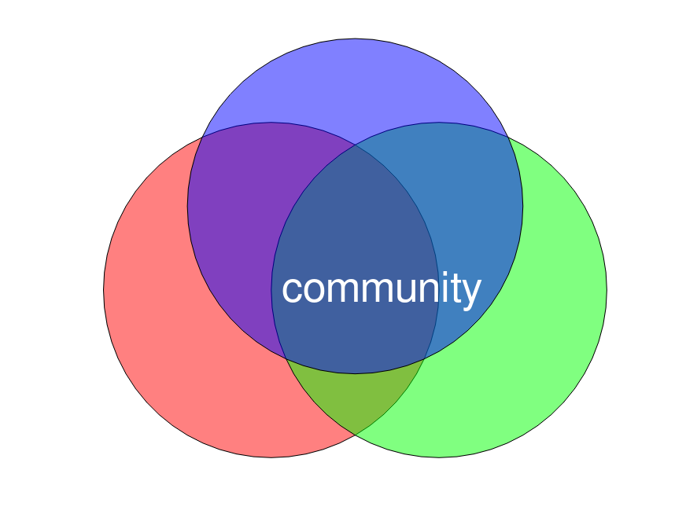

## Octave ile Venn Şeması Oluşturma

Bu belge, sağlanan Octave kodunun bir Venn şeması oluşturmak için nasıl çalıştığını açıklamaktadır.

### Kod

```octave
1;  # script
function h = venn_circle (x, y, r, c)
d = 2 * r;
h = rectangle (...
  "Position", [x - r, y - r, d, d], ...
  "Curvature", [1,1], ...
  "FaceColor", c, ...
  "FaceAlpha", 0.5);
daspect ([1,1,1]);
endfunction

venn_circle (0, 0, 2, "r");
venn_circle (2, 0, 2, "g");
venn_circle (1, 1, 2, "b");
text (0, 0, " community ", ...
  "FontSize", 26, ...
  "Color", "w");
axis off;
```

### Kodun Açıklaması

Bu kod, iç içe geçmiş üç daireden oluşan basit bir Venn şeması çizer ve ortasına metin ekler.

1.  **`function h = venn_circle (x, y, r, c)`**:
    *   Bu satır, bir daire çizmek için kullanılan `venn_circle` adında bir fonksiyon tanımlar.
    *   **Parametreler:**
        *   `x`, `y`: Dairenin merkezinin koordinatları.
        *   `r`: Dairenin yarıçapı.
        *   `c`: Dairenin rengini belirten karakter (örneğin, 'r' kırmızı için).
    *   `rectangle` fonksiyonunu `Curvature` (kıvrım) parametresini `[1,1]` olarak ayarlayarak tam bir daire oluşturur.
    *   `FaceAlpha`, 0.5 değeri dairelere yarı saydam bir görünüm vererek kesişim bölgelerinin görünmesini sağlar.
    *   `daspect ([1,1,1])` en-boy oranını eşitleyerek şeklin bozulmasını engeller ve dairelerin gerçekten daire gibi görünmesini sağlar.

2.  **Fonksiyon Çağrıları**:
    *   `venn_circle (0, 0, 2, "r");`: Merkezi (0,0) olan kırmızı bir daire çizer.
    *   `venn_circle (2, 0, 2, "g");`: Merkezi (2,0) olan yeşil bir daire çizer.
    *   `venn_circle (1, 1, 2, "b");`: Merkezi (1,1) olan mavi bir daire çizer.

3.  **Metin Ekleme**:
    *   `text (0, 0, " community ", ...)`: Şemanın üzerine "community" metnini ekler. Metin, beyaz renkte ve 26 punto büyüklüğündedir.

4.  **Eksenleri Gizleme**:
    *   `axis off;`: Çıktının daha temiz görünmesi için koordinat eksenlerini gizler.

### Çıktı
Bu kod çalıştırıldığında, üç dairenin kesişim alanlarını gösteren bir Venn şeması oluşturur. Daireler yarı saydamdır, bu da kesişim bölgelerinin görünmesini sağlar. Ortada "community" metni yer alır.


---
[Ana Sayfaya Dön](./)
